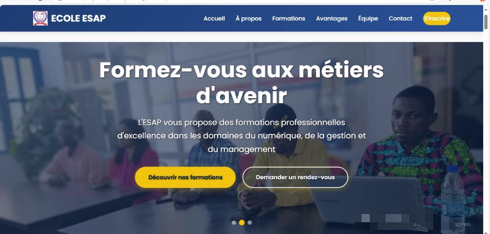

# 🌍 Site Vitrine École

**Projet** : Site web responsive codé en HTML/CSS/JavaScript pendant mes études.  
## Architecture simplifiée
- `index.html` : Contient tout le code (HTML+CSS+JS)
- `images/` : Stocke toutes les ressources visuelles

## Pour modifier
1. Éditez directement les balises `<style>` et `<script>` dans le HTML
2. Rafraîchissez le navigateur pour voir les changements

## 🎯 Objectifs  
- Montrer mes compétences en développement front-end.  
- Créer un site adapté à tous les écrans (mobile, tablette, PC).  

## 🔧 Fonctionnalités  
- **Design moderne** avec animations CSS.  
- **Formulaire de contact** fonctionnel.  
- **Optimisé pour le référencement** (SEO basique).  

## 🚀 Lien du Projet  
[Voir le site en ligne](https://devwebabidjan.github.io/projet-ecole)  

## 💻 Technologies Utilisées  
- HTML5  
- CSS3 (Flexbox, Grid)  
- JavaScript Vanilla  

---  
📩 **Contact** :  
Disponible pour des projets similaires ! [Message sur Fiverr](https://www.fiverr.com/tonprofil).  
